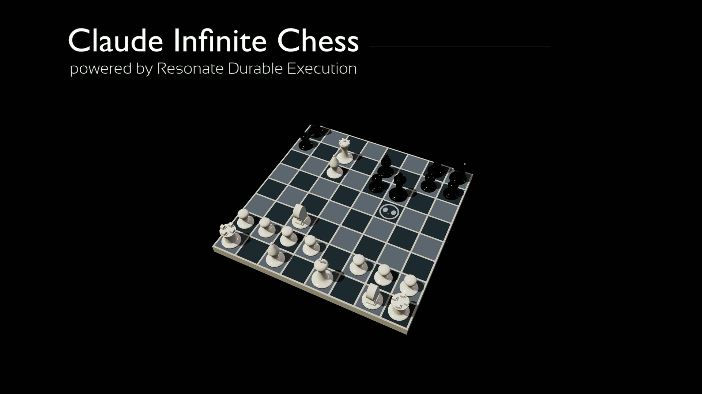

# Chess on GCP with Resonate

An AI-vs-AI chess game powered by [Resonate](https://resonatehq.io) durable execution, running on Google Cloud Platform. Two AI players compete move by move; each move is a durably-executed step, so if the process crashes mid-game it resumes from the next pending step instead of restarting the match.

Live demo: https://resonatehq-examples.github.io/resonate-chess-gcp/



```typescript
export function* chessGame(context: Context) {
  
  const chess = new Chess();

  while (!chess.isGameOver()) {
    const pFn = chess.turn() === "w" 
      ? gePlayer 
      : aiPlayer;
    
    const san = yield* context.run(pFn, chess.fen());
    chess.move(san);

    yield* context.run(publish, { gameOver: false, fen: chess.fen(), san });

    // Sleep for 10s because we are not made of tokens
    yield* context.sleep(10 * 1000);
  }

  yield* context.run(publish, { gameOver: true, result: gameResult(chess) });

  yield* context.detached(chessGame);
}
```

## How It Works

Every Google Cloud Function invocation has two phases: replay and resume. On replay, the Resonate SDK runs the function again from the top, but any promise that has already completed, whether from `context.run()` or `context.sleep()`, advances immediately instead of executing again. On resume, execution reaches the first pending promise and continues from there.

When execution reaches a pending `context.sleep()`, the workflow suspends and the current invocation ends. The Resonate server waits for the timer promise to complete, then starts a fresh invocation.

## Cost Profile

| Resource | Smallest option | Approximate cost |
|----------|-----------------|-----------------|
| Cloud SQL | `db-f1-micro` | ~$7/month |
| Resonate Server | Cloud Run, 1 min instance, 256MB | ~$5/month |
| Chess Function | Cloud Functions Gen2, 512 MB, every 15s, ~5s active runtime | ~$3/month |
| Firestore | free tier covers hobby use | $0 |
