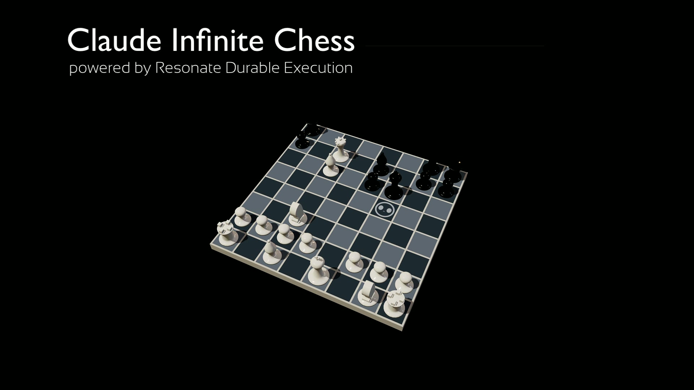

# Chess on GCP with Resonate

A live AI-vs-AI chess game powered by [Resonate](https://resonatehq.io) durable execution, running on Google Cloud Platform. White is a deterministic chess engine, Black is Claude Haiku 4.5 — each move is a durably-executed step, so if the process crashes mid-game it resumes from the next pending step instead of restarting the match.

Live demo: https://resonatehq-examples.github.io/resonate-chess-gcp/

Also powers the live hero on https://resonatehq.io.



```typescript
export function* chessGame(ctx: Context, gameNumber = 1) {
  const game = new Chess();
  let moveCount = 0;

  yield* ctx.run(publish, buildState(game, undefined, moveCount));

  while (!game.isGameOver()) {
    const uci = game.turn() === "w"
      ? yield* ctx.run(enginePlayer, game.fen(), WHITE_LEVEL)
      : (yield* ctx.run(agentPlayer, game.fen(), legalMovesUci(game), recentHistory(game))).move;

    const move = applyUciMove(game, uci);
    moveCount++;

    yield* ctx.run(publish, buildState(game, move, moveCount));
    yield* ctx.sleep(MOVE_DELAY_MS);
  }

  yield* ctx.sleep(GAME_PAUSE_MS);

  // Each game is its own root promise — replay scope stays bounded forever.
  yield* ctx.detached(chessGame, gameNumber + 1);
}
```

## How It Works

Every Google Cloud Function invocation has two phases: replay and resume. On replay, the Resonate SDK runs the function again from the top, but any promise that has already completed, whether from `ctx.run()` or `ctx.sleep()`, advances immediately instead of executing again. On resume, execution reaches the first pending promise and continues from there.

When execution reaches a pending `ctx.sleep()`, the workflow suspends and the current invocation ends. The Resonate server waits for the timer promise to complete, then starts a fresh invocation.

### One game = one root promise

`chessGame` resolves at game-over. The last yield is `ctx.detached(chessGame, n + 1)`, which starts the next game as a brand-new root with its own origin id. Replay scope is bounded to a single game forever, regardless of how long the demo runs.

This shape was a deliberate fix for the **replay-vs-lease cliff (`code 1199`)**. A previous version used `while(true) { play one game }` inside a single durable invocation. After thousands of accumulated child promises, each replay took longer than the task lease and the server would reassign tasks mid-execution. The detach-per-game shape avoids that — each game's promise tree is bounded.

We've separately observed that long-running self-detaching chains accumulate `task_id` segments per generation, which eventually overflows server `task.suspend` payloads and freezes the chain (HTTP 500 from the server on suspend). Conversation about that is at https://github.com/resonatehq/resonate-sdk-ts/issues/526 — for now we follow the SDK-blessed shape and accept periodic re-seeding as the operational pattern until the SDK guidance evolves. To re-seed, cancel any pending `chess-game-*` promises and invoke a fresh integer suffix:

```bash
resonate promises search --state pending --server <resonate-server-url> \
  | jq -r '.promises[].id' | grep -i chess \
  | xargs -r -I{} resonate promises cancel {} --server <resonate-server-url>

resonate invoke chess-game-<N> --func chessGame --arg <N> \
  --server <resonate-server-url> --target <function-url> --timeout 24h
```

`@resonatehq/gcp` defaults `ttl` (acquired-task lease) to 5min. We set it to 10min in `index.ts` so it always exceeds the Cloud Function's 540s timeout — belt-and-braces against any single invocation that legitimately runs long.

## State Bus — Firestore

Each move publishes a snapshot to Firestore at `chess/live`:

```ts
{
  fen: string,
  turn: "w" | "b",
  moveCount: number,
  isCheck: boolean,
  isCheckmate: boolean,
  isStalemate: boolean,
  isDraw: boolean,
  isGameOver: boolean,
  updatedAt: number,
  lastMove?: { from: string, to: string, captured?: string },
  agentReasoning?: string,   // Black's one-sentence reason for the move
  result?: "white" | "black" | "draw",
}
```

Browser clients subscribe via Firebase JS SDK `onSnapshot('chess/live')`. The `chess-board/` static page in this repo and the hero on resonatehq.io both consume this same shape. No SSE gateway, no always-on service on the worker side — the function scales to zero between moves.

## Players

- **White** — `js-chess-engine` at level 3 (pure JS, deterministic minimax). Pulled in as a Cloud Function dep, no native binary or WASM.
- **Black** — Claude Haiku 4.5 via the Anthropic SDK. Returns `{ move, reasoning }` as structured JSON output, validated against the legal-moves list with up to 2 retries on invalid output, then falls back to a random legal move if all retries fail.

## Cost Profile

| Resource | Sizing | Cost |
|----------|--------|------|
| Cloud SQL | `db-f1-micro` | ~$7/mo |
| Resonate Server | Cloud Run, 1 min instance, 256MB | ~$5/mo |
| Chess Function | Cloud Functions Gen2, 512MB, ~5s active every ~4.5s | ~$3/mo |
| Firestore | free tier covers hobby use | $0 |
| Anthropic API | ~1 Haiku 4.5 call per 9s (~300k calls/mo) | **~$50–150/mo** |

The Anthropic line is the real cost driver — the bot runs continuously, so the spend is steady-state regardless of viewers. The range reflects uncertainty in average game length and prompt-cache hit rate. Switch the player back to engine-vs-engine (delete `agentPlayer` and route both sides to `enginePlayer`) to drop this to $0.

## Files

- `chess-match/src/index.ts` — registers `chessGame`, injects Firestore as a Resonate dependency, exports the HTTP handler
- `chess-match/src/chess.ts` — the `chessGame` generator, both players, Firestore publish, helpers
- `chess-board/` — static SVG board for GitHub Pages, subscribes to `chess/live`
- `firestore.rules` — public-read on `chess/{docId}`, writes server-only

## Deploy

### One-time setup (per GCP project)

```bash
# Anthropic API key for the Black player. Create the secret, or add a new
# version if it already exists.
echo -n "<ANTHROPIC_API_KEY>" | gcloud secrets create anthropic-api-key \
  --data-file=- --project=<gcp-project> \
  || echo -n "<ANTHROPIC_API_KEY>" | gcloud secrets versions add anthropic-api-key \
       --data-file=- --project=<gcp-project>

# Firestore rules — re-deploy whenever firestore.rules changes.
firebase deploy --only firestore:rules --project=<gcp-project>
```

### Migrating from a prior deployment (the order matters)

If a `chessGame` chain is already running on the Resonate server (from a prior version of this worker), **drain it before deploying new code**. Otherwise the in-flight workflow replays through the new code path with mismatched promise value shapes (older child-promise values were plain UCI strings; new code destructures `{move, reasoning}`) and crashes with `Invalid move: undefined`, poisoning the chain.

```bash
# 1) Cancel any in-flight chain first (idempotent — safe if none exist)
resonate promises search --state pending --server <resonate-server-url> \
  | jq -r '.promises[].id' | grep -i chess \
  | xargs -r -I{} resonate promises cancel {} --server <resonate-server-url>
```

### Deploy the worker

```bash
cd chess-match
npm run build
gcloud functions deploy chess-match \
  --gen2 --region=us-central1 --runtime=nodejs22 \
  --source=. --entry-point=handler --trigger-http \
  --allow-unauthenticated \
  --memory=512Mi --timeout=540s \
  --set-env-vars=RESONATE_URL=<resonate-server-url> \
  --set-secrets=ANTHROPIC_API_KEY=anthropic-api-key:latest \
  --project=<gcp-project>

# Capture the function URL for the seed command below.
FUNCTION_URL=$(gcloud functions describe chess-match --gen2 \
  --region=us-central1 --project=<gcp-project> \
  --format='value(serviceConfig.uri)')
echo "$FUNCTION_URL"
```

### Seed the chain

```bash
# Pick the next free game number. The Resonate server rejects duplicate IDs,
# so if chess-game-1 was used in a prior deployment, bump to 2, 3, etc.
# (Or use a UUID suffix: chess-game-$(uuidgen | tr -d '-' | head -c 8).)
SEED_ID=chess-game-1

resonate promises get "$SEED_ID" --server <resonate-server-url> 2>/dev/null \
  && { echo "ID $SEED_ID already exists — bump SEED_ID and retry."; exit 1; }

resonate invoke "$SEED_ID" \
  --func chessGame --data '{"args":[1]}' \
  --server <resonate-server-url> \
  --target "$FUNCTION_URL" \
  --timeout 24h
```

### Rollback

If the new deployment misbehaves (runaway Anthropic calls, crashing chain, etc.):

```bash
# Kill the chain immediately to stop Anthropic spend.
resonate promises search --state pending --server <resonate-server-url> \
  | jq -r '.promises[].id' | grep -i chess \
  | xargs -r -I{} resonate promises cancel {} --server <resonate-server-url>

# Re-deploy the prior version. With this repo, `git checkout <prior-sha> -- chess-match`
# then re-run the deploy command above. Without git, redeploying from your last
# known-good `dist/` works too.
```
